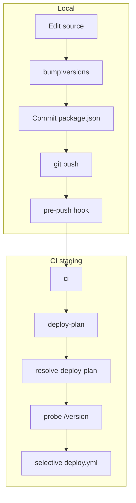

# Selective deploy pipeline — Linear intake pack

**Date:** 2026-06-29  
**Purpose:** Source document for `.cursor/skills/linear-intake/SKILL.md` — create **one epic + five child tasks** on Linear team **PipeWatch** (`PW-*`), project **PipeWatch Roadmap**. Stops at **Ready**.

**Operator command:** `linear-intake this doc` or `create Linear issues from docs/internal/IssueSmith_Deploy_Pipeline_Adaptation.md`

**Reference implementation:** IssueSmith `staging` branch (`~/projects/issuesmith`) — `docs/devops-cicd.md`, `scripts/ci/*`, `.githooks/pre-push`

**Assessment / gap detail:** [Appendix — background & locked decisions](#appendix-background--locked-decisions)

---

## Intake metadata

| Field | Value |
|---|---|
| Structure | **Epic** + **5 tasks** (multi-step — epic required) |
| Epic title | `Selective version-aware deploy pipeline` |
| Epic labels | `type:epic`, `domain:infrastructure` |
| Epic priority | High (2) |
| Project | PipeWatch Roadmap |
| Assignee | `me` |
| PRD refs | §22 (CI/CD pipeline) |

### Child issue map (create in this order)

| # | Proposed title | Labels | Effort | Depends on |
|---|---|---|---|---|
| 1 | `CI: Add per-deployable versioning toolchain` | `type:task`, `domain:infrastructure` | L | none |
| 2 | `CI: Add GET /version on deployable surfaces` | `type:task`, `domain:infrastructure` | M | none *(parallel with 1)* |
| 3 | `CI: Port deploy-plan scripts to scripts/ci` | `type:task`, `domain:infrastructure` | L | child 1 |
| 4 | `CI: Enable selective deploy workflows` | `type:task`, `domain:infrastructure` | XL | children 2, 3 |
| 5 | `CI: Update CI/CD docs for selective deploy` | `type:task`, `domain:operations` | S | child 4 |

After creation: Linear keys **PW-224** (epic) through **PW-229** (child 5) — see child map below.

---

## Epic — paste into Linear

**Title:** Selective version-aware deploy pipeline

```markdown
## Feature: Selective version-aware deploy pipeline

**Background:** PipeWatch deploys every surface on every `staging` push. Adopt the IssueSmith `staging` pipeline: live `/version` probes, per-deployable semver, pre-push bump enforcement, and plan-gated selective deploy/sync/smoke. Retain PipeWatch `release.yml` + `DEPLOYED_VERSION` for production (not deploy-on-`main`). PRD refs: prd §22.

**Source doc:** `docs/internal/IssueSmith_Deploy_Pipeline_Adaptation.md`

---

### Sub-issues

| Issue | Domain | Description |
|---|---|---|
| PW-225 | Infra | Per-deployable versioning toolchain (`bump:versions`, pre-push hook) |
| PW-226 | Infra | `GET /version` on api, worker, web, marketing, admin |
| PW-227 | Infra | Port deploy-plan + smoke scripts to `scripts/ci/` |
| PW-228 | Infra | Enable selective deploy workflows (`deploy-plan.yml`, refactor `deploy.yml`) |
| PW-229 | Ops | Update PRD §22, devops doc, cursor rules |

---

### Goal

Staging and production only deploy surfaces whose `package.json` semver is greater than live `/version`. Developers bump versions locally before push; CI skips unchanged surfaces. Marketing is a first-class selective-deploy surface.

---

### Product rules (epic-level)

- Production deploy stays **release-published** (`release.yml`) — not IssueSmith deploy-on-`main`.
- Fly production slug stays **`prod`**; CI migrations use **`DATABASE_URL_UNPOOLED`** (Neon).
- Marketing: full selective deploy (plan, sync, deploy, smoke with `/health` + `/version`).
- CE GHCR: plan-gated `push_ghcr_*`; staging tags **`dev`** + **`short_sha`** only (drop `nightly`).
- Admin migrations: **split** `run-migrate.sh` vs `run-migrate-admin.sh` + separate GHA jobs.
- i18n locale JSON under `apps/web` / `apps/marketing` **requires** version bump.
- Probe secrets: script fallback chains — **no duplicate Phase keys** (see child 3).
- Initial deployable semver seed: **`0.1.0`** on all five apps.
- CI scripts path: **`scripts/ci/`** (migrate from `.github/scripts/`).
- Delete **`version-check.yml`** — replaced by pre-push gate (child 1).

---

### Suggested implementation order

1. **PW-225** + **PW-226** (parallel)
2. **PW-227** (after 1 — needs `probe-version.mjs`)
3. **PW-228** (after 2 + 3)
4. **PW-229** (after 4)

---

See child issues for AC, files, and tests.
```

---

## Child 1 — Per-deployable versioning toolchain

**Title:** `CI: Add per-deployable versioning toolchain`  
**Parent:** epic above  
**Depends on:** none  
**Labels:** `type:task`, `domain:infrastructure`, `effort:L`  
**Priority:** High (2)

```markdown
## CI: Add per-deployable versioning toolchain

**Parent feature:** PW-224 — Selective version-aware deploy pipeline
**Depends on:** none
**Spec refs:** prd §22

---

### Scope

Port IssueSmith local versioning end-to-end before enabling selective deploy in CI. Replace monorepo-unified `version-check.yml` with per-deployable `package.json` semver + pre-push enforcement.

**PipeWatch `SHARED_LIB_CONSUMERS`:**

| Shared package | Bump deployables when changed |
|---|---|
| `packages/config` | api, worker, web, marketing, admin |
| `packages/db` | api, worker |
| `packages/db-admin` | admin |
| `packages/types` | api, worker, web |
| `packages/utils` | api, worker, web, admin |
| `packages/github-app-auth` | api, worker, admin |
| `packages/ui` | web, marketing, admin |

Deployables: `apps/api`, `apps/worker`, `apps/web`, `apps/marketing`, `apps/admin` — seed all at **`0.1.0`**.

---

### Acceptance criteria

- [ ] `scripts/ci/probe-version.mjs` — semver helpers + live probe utilities
- [ ] `scripts/lib/package-version-policy.mjs` — PipeWatch consumer map above
- [ ] `scripts/bump-package-versions.mjs` — `pnpm bump:versions`, `bump:versions:force`
- [ ] `scripts/check-push-version-bumps.mjs` — pre-push gate for `staging`/`main`
- [ ] `scripts/check-push-version-bumps.spec.ts` — Vitest coverage
- [ ] `.githooks/pre-push` + `scripts/setup-hooks.sh` — `pnpm setup:hooks`
- [ ] Root `package.json` scripts: `bump:versions`, `check:push-version-bumps`, `setup:hooks`
- [ ] `.cursor/rules/15-deploy-version-bumps.mdc` — operator/agent workflow
- [ ] Remove `version-check` job from `.github/workflows/pr.yml`
- [ ] Delete `.github/workflows/version-check.yml`
- [ ] Seed `apps/*/package.json` version `0.1.0`
- [ ] `pnpm test:scripts` includes new specs
- [ ] Locale JSON under `apps/web/src/i18n/` and `apps/marketing/` is **not** in policy ignore list

---

### Files (expected)

- `scripts/ci/probe-version.mjs`
- `scripts/lib/package-version-policy.mjs`
- `scripts/bump-package-versions.mjs`
- `scripts/check-push-version-bumps.mjs`
- `scripts/check-push-version-bumps.spec.ts`
- `scripts/setup-hooks.sh`
- `.githooks/pre-push`
- `.cursor/rules/15-deploy-version-bumps.mdc`
- `package.json` (scripts)
- `apps/*/package.json` (versions)
- `.github/workflows/pr.yml` (remove version-check)
- Delete: `.github/workflows/version-check.yml`

---

### Tests

- Unit: `pnpm test:scripts` — `check-push-version-bumps.spec.ts`
- Manual: `pnpm check:push-version-bumps`; push to staging with unbumped deployable change → blocked
```

---

## Child 2 — GET /version on deployable surfaces

**Title:** `CI: Add GET /version on deployable surfaces`  
**Parent:** epic above  
**Depends on:** none *(parallel with child 1)*  
**Labels:** `type:task`, `domain:infrastructure`, `effort:M`  
**Priority:** High (2)

```markdown
## CI: Add GET /version on deployable surfaces

**Parent feature:** PW-224 — Selective version-aware deploy pipeline
**Depends on:** none
**Spec refs:** prd §22

---

### Endpoints / services

Public JSON liveness for deploy-plan probes and smoke. Each returns `{ "version": "<semver>" }` from that app's `package.json`.

| Surface | Route | Platform |
|---|---|---|
| api | `GET /version` | Fly (Hono) |
| worker | `GET /version` (+ `/health`) | Fly |
| web | `GET /version` | Cloudflare Worker (OpenNext) |
| marketing | `GET /version` (+ `/health`) | Cloudflare Worker (Astro) |
| admin | `GET /version` | Fly (Nest) |

Marketing is a **first-class** selective-deploy surface (not root-only smoke).

Also split admin DB migrate script (used by child 4 workflows):

- `scripts/ci/run-migrate.sh` — product schema only (`DATABASE_URL_UNPOOLED`)
- `scripts/ci/run-migrate-admin.sh` — `@pipewatch/db-admin` only

---

### Acceptance criteria

- [ ] All five surfaces expose `GET /version` returning correct `package.json` semver
- [ ] api/worker/admin follow same OpenAPI/public pattern as existing `/health`
- [ ] web OpenNext route works on Cloudflare Worker build
- [ ] marketing Astro/Worker handler serves `/version` and `/health`
- [ ] `run-migrate.sh` runs product migrations only
- [ ] `run-migrate-admin.sh` runs admin migrations only
- [ ] Unit tests for version handlers where colocated patterns exist

---

### Files (expected)

- `apps/api/src/routes/version.ts` (or equivalent)
- `apps/worker/src/...` version route
- `apps/web/...` version route (App Router or worker handler)
- `apps/marketing/...` version route
- `apps/admin/src/routes/version.ts` (or equivalent)
- `scripts/ci/run-migrate.sh` (split product-only)
- `scripts/ci/run-migrate-admin.sh` (new)

---

### Tests

- Unit: colocated `*.test.ts` per surface version route
- Integration: optional smoke against local dev servers
```

---

## Child 3 — Port deploy-plan scripts

**Title:** `CI: Port deploy-plan scripts to scripts/ci`  
**Parent:** epic above  
**Depends on:** PW-227 (child 3 — `probe-version.mjs`)  
**Labels:** `type:task`, `domain:infrastructure`, `effort:L`  
**Priority:** High (2)

```markdown
## CI: Port deploy-plan scripts to scripts/ci

**Parent feature:** PW-224 — Selective version-aware deploy pipeline
**Depends on:** PW-225
**Spec refs:** prd §22

---

### Scope

Port IssueSmith deploy-plan machinery; consolidate PipeWatch CI scripts under `scripts/ci/`. Include marketing in `SURFACES`. Probe origin **fallback chains** (no new Phase secrets):

| Surface | Resolution order |
|---|---|
| api | `APP_BASE_URL` → `API_ORIGIN` → `NEXT_PUBLIC_API_URL` |
| web | `FRONTEND_ORIGIN` → `APP_URL` |
| marketing | `MARKETING_ORIGIN` → `MARKETING_URL` |
| admin | `ADMIN_URL` |
| worker | `WORKER_PROBE_URL` (optional; couples to api from GHA) |

Worker deploy couples to api when GHA cannot reach Fly 6PN. Production plan skips surfaces `< 1.0.0`.

---

### Acceptance criteria

- [ ] `scripts/ci/resolve-deploy-plan.mjs` — `@pipewatch/*` surfaces, marketing included
- [ ] `scripts/ci/resolve-deploy-plan.spec.ts` — Vitest (plan flags, skip reasons, fallbacks)
- [ ] `scripts/ci/smoke-staging-health.sh` — flags `--api|--web|--marketing|--worker|--admin`, `/health` + `/version`
- [ ] `scripts/ci/smoke-admin-health.sh`
- [ ] `scripts/ci/derive-sentry-release.mjs` + `.sh` — per-package `api`/`web`
- [ ] `scripts/ci/create-draft-release.mjs` + `.spec.ts`
- [ ] Move `.github/scripts/*` → `scripts/ci/`; update all workflow `run:` paths
- [ ] `pnpm test:scripts` passes
- [ ] Do **not** port `build-push-ghcr.sh` — keep Buildx CE workflow (child 4 gates it)

---

### Files (expected)

- `scripts/ci/resolve-deploy-plan.mjs`
- `scripts/ci/resolve-deploy-plan.spec.ts`
- `scripts/ci/smoke-staging-health.sh`
- `scripts/ci/smoke-admin-health.sh`
- `scripts/ci/derive-sentry-release.mjs`
- `scripts/ci/derive-sentry-release.sh`
- `scripts/ci/create-draft-release.mjs`
- `scripts/ci/create-draft-release.spec.ts`
- Migrated: `sync-secrets.sh`, `deploy-fly.sh`, `deploy-cf-worker.sh`, `provision-*.sh`, `sentry-release.sh`, `setup-flyctl.sh`, etc.
- Remove or redirect: `.github/scripts/*`

---

### Tests

- Unit: `resolve-deploy-plan.spec.ts`, `create-draft-release.spec.ts`, `check-push-version-bumps.spec.ts`
- Shell: existing `*.test.sh` updated for new paths
```

---

## Child 4 — Enable selective deploy workflows

**Title:** `CI: Enable selective deploy workflows`  
**Parent:** epic above  
**Depends on:** PW-226, PW-227  
**Labels:** `type:task`, `domain:infrastructure`, `effort:XL`  
**Priority:** High (2)

```markdown
## CI: Enable selective deploy workflows

**Parent feature:** PW-224 — Selective version-aware deploy pipeline
**Depends on:** PW-226, PW-227
**Spec refs:** prd §22

---

### Scope

Wire deploy-plan into staging and release entry points. Refactor `deploy.yml` for plan-gated selective jobs. Retain `release.yml` + `DEPLOYED_VERSION` + `check-not-deployed`.

**Target staging chain:**

```
staging.yml → ci → deploy-plan.yml → deploy.yml (caller_plan=true, selective)
  → ce-images (if push_ghcr_*)
```

**Target release chain:**

```
release.yml → check-not-deployed → deploy-plan.yml → deploy.yml → record DEPLOYED_VERSION
  → ce-images (if push_ghcr_*)
```

**deploy.yml job graph (selective):**

```
plan → provision-fly → provision-redis → sync-secrets (scoped)
  → migrate (if run_migrate) ∥ derive-sentry-release-api
  → migrate-admin (if run_migrate_admin)
  → deploy-* (per surface flag)
  → smoke (flags per deployed surface)
```

---

### Acceptance criteria

- [ ] New `.github/workflows/deploy-plan.yml` (callable; live `/version` probes)
- [ ] `deploy.yml` — `caller_plan`, per-surface `if:`, selective `sync_services`, split migrate jobs
- [ ] `staging.yml` — plan job → deploy with plan outputs; `workflow_dispatch` (git_ref, deploy_mode)
- [ ] `release.yml` — deploy-plan before deploy; retain tag-level skip
- [ ] `sync-secrets.yml` — `services` input from plan
- [ ] `prepare-release.yml` — `create-draft-release.mjs` with api/web deploy flags
- [ ] CE images gated on `push_ghcr_*`; staging tags `dev` + `short_sha` only (remove `nightly`)
- [ ] `pr.yml` — CI + E2E only (no version-check — done in child 1)
- [ ] Smoke uses plan-built flags including `--marketing`
- [ ] Bump GitHub Actions pin SHAs when touching workflows
- [ ] Staging deploy skips surfaces where intended semver <= live `/version`

---

### Files (expected)

- `.github/workflows/deploy-plan.yml` (new)
- `.github/workflows/deploy.yml` (major refactor)
- `.github/workflows/staging.yml`
- `.github/workflows/release.yml`
- `.github/workflows/main.yml` (CE tag inputs if needed)
- `.github/workflows/build-and-push-ce-image.yml` (plan `if:` gates)
- `.github/workflows/prepare-release.yml`
- `.github/workflows/sync-secrets.yml`

---

### Tests

- CI: push to staging with single-surface bump deploys only that surface
- Manual: `gh workflow run staging.yml --ref staging` with `deploy_mode=manual`
- `pnpm test:scripts` still passes
```

---

## Child 5 — Update CI/CD docs

**Title:** `CI: Update CI/CD docs for selective deploy`  
**Parent:** epic above  
**Depends on:** PW-228  
**Labels:** `type:task`, `domain:operations`, `effort:S`  
**Priority:** Medium (3)

```markdown
## CI: Update CI/CD docs for selective deploy

**Parent feature:** PW-224 — Selective version-aware deploy pipeline
**Depends on:** PW-228
**Spec refs:** prd §22

---

### Scope

Bring engineering docs and agent rules in line with implemented pipeline. This child runs **after** workflows land.

---

### Acceptance criteria

- [x] Update `docs/internal/PipeWatch_MVP_PRD.md` §22 — selective deploy, `deploy-plan.yml`, versioning, `scripts/ci/` paths
- [x] Add or expand `docs/internal/devops-cicd.md` — PipeWatch hosts, surfaces, secrets, probe fallbacks
- [x] Update `.cursor/rules/06-local-ci-before-commit.mdc` — pre-push version gate vs full CI gate order
- [x] Update `.cursor/skills/orchestrator/prompt-templates.md` — `pnpm bump:versions` before push
- [x] Document `pnpm setup:hooks` in onboarding/README
- [x] Archive or remove stale `docs/internal/ci-cd-example/` when parity achieved
- [x] Update this intake pack: replace `PW-TBD-*` with real Linear keys (PW-224 through PW-229)

---

### Files (expected)

- `docs/internal/PipeWatch_MVP_PRD.md`
- `docs/internal/devops-cicd.md` (created)
- `.cursor/rules/06-local-ci-before-commit.mdc`
- `.cursor/skills/orchestrator/prompt-templates.md`
- `docs/internal/IssueSmith_Deploy_Pipeline_Adaptation.md`
- `docs/internal/ci-cd-example/` (removed — parity with live workflows)

---

### Tests

- Docs-only — verifier checks PRD §22 matches live workflow filenames
```

---

## After intake — orchestrator handoff

```text
orchestrate PW-224
```

Suggested batch order: child 1 ∥ child 2 → child 3 → child 4 → child 5.

Update epic description sub-issue table with real `PW-*` keys after creation.

---

## Appendix — background & locked decisions

### Gap summary (PipeWatch today vs IssueSmith staging)

| Area | PipeWatch today | Target |
|---|---|---|
| Deploy trigger | Full deploy every `staging` push | Live `/version` compare → selective deploy |
| Versioning | Unified root version (`version-check.yml`) | Per-deployable semver + pre-push hook |
| `deploy-plan.yml` | Missing | Callable plan workflow |
| `deploy.yml` | Always all surfaces | `caller_plan` + conditional jobs |
| Marketing | Root `/` smoke only | `/health` + `/version` + plan-gated deploy |
| Production | `release: published` + `DEPLOYED_VERSION` | **Keep** + add per-surface plan inside |
| CE images | Always build; `dev`/`nightly`/SHA | Plan-gated; `dev` + `short_sha` only |
| Scripts | `.github/scripts/` | `scripts/ci/` |
| Sentry release | Root monorepo version | Per-package api/web |

**Source of truth for port:** IssueSmith `staging` — `deploy.yml`, `deploy-plan.yml`, `staging.yml`, `scripts/ci/*`.

**Local ↔ CI contract:** Pre-push hook and `resolve-deploy-plan.mjs` both read `apps/<surface>/package.json` `version` — single source of truth.

### Surfaces

| Surface | Platform |
|---|---|
| api, worker, admin | Fly.io (`pipewatch-{staging\|prod}-*`) |
| web, marketing | Cloudflare Workers |
| redis | Fly.io |

CE GHCR: `api`, `worker`, `web` only. Admin Cloud-only.

### Versioning ↔ deploy flow



### Locked decisions (all resolved)

1. **Admin migrate** — split `run-migrate.sh` / `run-migrate-admin.sh` + separate GHA jobs.
2. **i18n** — locale JSON under web/marketing requires version bump.
3. **CE tags** — plan-gated Buildx; staging `dev` + `short_sha`; no `nightly`; no `build-push-ghcr.sh` port.
4. **Probe secrets** — fallback chains in scripts; no duplicate Phase keys.
5. **Semver seed** — `0.1.0` all deployables at bootstrap.
6. **Production gate** — keep `release.yml`; not deploy-on-`main`.
7. **Fly slug** — keep `prod` (not `production`).
8. **Neon migrate** — keep `DATABASE_URL_UNPOOLED` in CI.

### `deploy.yml` inputs to add

`force_full_deploy`, `deploy_mode`, `caller_plan`, `deploy_api`…`deploy_admin`, `run_migrate`, `run_migrate_admin`, `push_ghcr_*`, `sync_services`, `skip_reasons`.

### Related artifacts

- `docs/internal/PipeWatch_MVP_PRD.md` §22
- IssueSmith: `~/projects/issuesmith` branch `staging`
- `.cursor/skills/linear-intake/SKILL.md`
