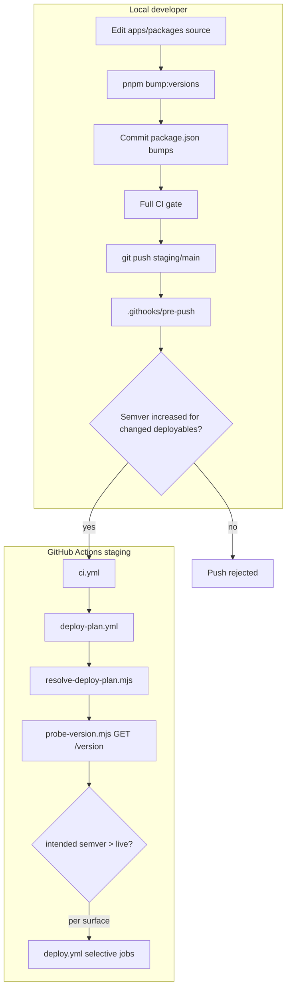

# IssueSmith deploy pipeline — adaptation assessment for PipeWatch

**Date:** 2026-06-29  
**Scope:** Compare PipeWatch’s current GitHub Actions deploy chain with the **IssueSmith** pipeline on the `staging` branch (`mdg-labs/issuesmith`, `~/projects/issuesmith`). Document gaps and a concrete adaptation plan. This is an engineering assessment — not a PRD change.

**Source of truth for “new” pipeline:** IssueSmith `staging` branch workflows and `scripts/ci/*` (not IssueSmith’s `staging.yml` trigger semantics alone — that file is the staging *branch entry point*, while `deploy.yml` / `deploy-plan.yml` are the reusable deploy chain we want to port).

**Reference doc in IssueSmith:** `docs/devops-cicd.md` (IssueSmith staging).

---

## Executive summary

IssueSmith’s deploy pipeline is a **selective, version-aware** system: before any Fly/CF deploy it probes each live surface’s `/version` endpoint, compares against the intended `package.json` semver for that surface, and only deploys (and syncs secrets for) surfaces that actually changed. PipeWatch today runs a **full deploy of every surface** on every push to `staging`, with no live-version compare and no per-surface deploy gating.

The largest adaptation work spans **product endpoints**, **local versioning toolchain**, and **CI deploy orchestration**:

1. Add `/version` endpoints on **all** deployable surfaces (api, web, worker, marketing, admin).
2. Adopt IssueSmith **per-deployable semver** end-to-end: `bump:versions` CLI, pre-push hook, `package-version-policy.mjs`, deploy-plan probes.
3. Port `resolve-deploy-plan.mjs`, `probe-version.mjs`, and `deploy-plan.yml`.
4. Refactor `deploy.yml` to plan-gated selective jobs (migrate, sync-secrets scope, smoke flags).
5. **Retain** PipeWatch’s release-published production gate (`release.yml` + `DEPLOYED_VERSION`) — selective deploy runs inside that flow, not deploy-on-`main`.

**Local ↔ CI contract:** The pre-push hook enforces that deploy-relevant commits bump the right `apps/*/package.json` versions. CI `resolve-deploy-plan.mjs` reads those same versions and compares to live `/version` — no duplicate versioning logic.

---

## Surfaces (same topology)

Both products deploy five hosted surfaces plus Redis:

| Surface | PipeWatch platform | IssueSmith platform |
|---|---|---|
| api | Fly.io | Fly.io |
| worker | Fly.io | Fly.io |
| web | Cloudflare Workers (OpenNext) | Cloudflare Workers |
| marketing | Cloudflare Workers (Astro) | Cloudflare Workers (Astro) |
| admin | Fly.io | Fly.io |
| redis | Fly.io | Fly.io |

**CE / GHCR:** Both publish split images (`api`, `worker`, `web`) to GHCR for self-hosters. Admin is Cloud-only in both.

---

## Workflow map — today vs IssueSmith staging

### Entry-point workflows

| Trigger | PipeWatch today | IssueSmith staging |
|---|---|---|
| `pull_request` | `pr.yml` → CI + `version-check.yml` (+ E2E staging→main) | `pr.yml` → CI only |
| Push `staging` | `staging.yml` → CI → **full** `deploy.yml` + CE images (parallel) | `staging.yml` → CI → **`deploy-plan.yml`** → **selective** `deploy.yml` + plan-gated GHCR `:dev` pushes |
| Push `main` | `main.yml` → CI → `prepare-release.yml` + CE images; **no deploy** | `main.yml` → CI → **production deploy** + plan-gated GHCR semver + `prepare-release.yml` |
| Release published | `release.yml` → `check-not-deployed` → `deploy.yml` + CE images | *(no equivalent — production deploys on `main` push)* |
| Manual dispatch | `sync-secrets.yml`, `e2e.yml` | `staging.yml` (ref + deploy mode), `sync-secrets.yml` |

**PipeWatch target (PR):** `pr.yml` → CI + E2E only — **no** `version-check.yml` (version enforcement moves to local pre-push hook).

### Reusable deploy chain

| Workflow | PipeWatch | IssueSmith staging |
|---|---|---|
| `deploy-plan.yml` | **Missing** | Live `/version` probe plan; callable standalone |
| `deploy.yml` | Full deploy always | Plan job + conditional migrate/deploy/smoke per surface |
| `provision-fly.yml` | Present | Present (after plan) |
| `provision-redis.yml` | Present | Present |
| `sync-secrets.yml` | Present; always `services: all` from deploy | Present; **`services` input** from plan (`api,worker,…` or `all`) |
| `prepare-release.yml` | Root monorepo version; runs on `main` | Per-surface api/web versions; runs after production deploy on `main` |

---

## Core behavioural differences

### 1. Selective deployment (deploy plan)

**IssueSmith** (`scripts/ci/resolve-deploy-plan.mjs` + `probe-version.mjs`):

- Probes `GET {origin}/version` per surface with semver compare (`intended > live` → deploy).
- Origins from GHA **secrets**: `APP_BASE_URL` (api, fallback `API_ORIGIN`), `FRONTEND_ORIGIN`, `MARKETING_ORIGIN`, `ADMIN_URL`; worker uses `WORKER_PROBE_URL` when reachable (otherwise **couples to api** deploy).
- Staging probes send **Cloudflare Access** service-token headers.
- Production skips surfaces with package version `< 1.0.0`.
- Outputs: per-surface deploy flags (including **`deploy_marketing`**), `run_migrate` / `run_migrate_admin`, `push_ghcr_*`, `sync_services`, `skip_reasons`.
- `deploy_mode`: `auto` (live compare) | `manual` (force all surfaces).
- `should_deploy=false` → sync-only plan (`sync_services: all`).

**PipeWatch today:**

- No deploy plan. Every `staging` push deploys api, worker, web, marketing, admin after migrate.
- `release.yml` has a **tag-level** skip (`DEPLOYED_VERSION` == release tag) but no per-surface logic.

**Adapt:**

- [ ] Add `deploy-plan.yml` (port from IssueSmith).
- [ ] Add `scripts/ci/resolve-deploy-plan.mjs` + `probe-version.mjs` (rename surfaces to `@pipewatch/*`, map origins to PipeWatch secrets — see § Secret mapping).
- [ ] Wire `staging.yml`: `plan` job → pass `caller_plan: true` outputs into `deploy.yml`.
- [ ] Refactor `deploy.yml` plan stage and conditional job `if:` blocks (port IssueSmith structure).
- [ ] Add Vitest specs (`resolve-deploy-plan.spec.ts`, `probe-version` tests) under `scripts/ci/` or `.github/scripts/`.

### 2. Versioning model (full toolchain)

IssueSmith and PipeWatch target the **same** model: independent deployable semvers, shared libs at `0.0.0`, local pre-push enforcement, CI live-compare. PipeWatch must port the **entire** toolchain — not only `resolve-deploy-plan.mjs`.

#### IssueSmith components (all to port)

| Component | Path | Role |
|---|---|---|
| Shared policy | `scripts/lib/package-version-policy.mjs` | `SHARED_LIB_CONSUMERS`, gap analysis, semver helpers — used by bump CLI **and** pre-push gate |
| Bump CLI | `scripts/bump-package-versions.mjs` | `pnpm bump:versions` — detect gaps, interactive or `-- patch` / `-- web minor` |
| Pre-push script | `scripts/check-push-version-bumps.mjs` | Reads git pre-push stdin; blocks push to `staging`/`main` if deploy code changed without semver bump |
| Semver probe helpers | `scripts/ci/probe-version.mjs` | `semverGt`, `semverGte`, `incrementSemver` — shared by policy, bump CLI, deploy plan |
| Git hook | `.githooks/pre-push` | Runs `check-push-version-bumps.mjs` |
| Hook installer | `scripts/setup-hooks.sh` | `git config core.hooksPath .githooks` |
| Cursor rule | `.cursor/rules/15-deploy-version-bumps.mdc` | Agent/operator workflow |
| Tests | `scripts/check-push-version-bumps.spec.ts`, `scripts/ci/resolve-deploy-plan.spec.ts`, `scripts/ci/probe-version` coverage via resolve spec | Vitest in `pnpm test:scripts` |

#### PipeWatch today (to retire)

- **Unified monorepo version** — `version-check.yml` on every PR requires root `package.json` version === every workspace package.
- All deployables at `0.0.0`.
- Single Sentry release from root version + short SHA.
- No `bump:versions`, no pre-push hook, no `setup:hooks`.

#### PipeWatch target behaviour

| Concern | Target |
|---|---|
| Deployable versions | Independent semver in `apps/api`, `apps/worker`, `apps/web`, `apps/marketing`, `apps/admin` |
| Shared packages | Stay `0.0.0` in `packages/*`; changing shared code requires **consumer** deployable bumps |
| Root `package.json` | Stays `private: true`; version field **not** synced to apps (remove uniform-version PR gate) |
| Pre-push | `.githooks/pre-push` on pushes to `refs/heads/staging` and `refs/heads/main` only |
| Skip once | `SKIP_DEPLOY_VERSION_BUMP_CHECK=1 git push --no-verify` (escape hatch, documented in rule) |
| Production gate | Deploy plan skips surfaces with package semver `< 1.0.0` (same as IssueSmith) |
| Sentry | Per-package release via `derive-sentry-release.mjs` (`api`, `web` only for source maps) |
| Draft release | `create-draft-release.mjs` titles from api/web package versions when those surfaces deploy |

#### PipeWatch `SHARED_LIB_CONSUMERS` (fit to monorepo)

Port `package-version-policy.mjs` with this map (adjust if deps change):

| Shared package (`packages/*`) | Bump these deployables when shared code changes |
|---|---|
| `config` | api, worker, web, marketing, admin |
| `db` | api, worker |
| `db-admin` | admin |
| `types` | api, worker, web |
| `utils` | api, worker, web, admin |
| `github-app-auth` | api, worker, admin |
| `ui` | web, marketing, admin |

**Deployable dirs** (`DEPLOYABLE_DIRS`):

```text
apps/api · apps/worker · apps/web · apps/marketing · apps/admin
```

**Package names** (`PACKAGE_DIR_TO_NAME`):

```text
@pipewatch/api · @pipewatch/worker · @pipewatch/web · @pipewatch/marketing · @pipewatch/admin
```

**Ignored paths** (no bump required): `*.md`, `*.spec.ts`, `*.test.ts`, `vitest.config.ts`, locale JSON-only changes policy TBD — start with IssueSmith ignore list; extend for `i18n` catalog-only edits if desired.

#### `package.json` scripts to add

```json
{
  "bump:versions": "node scripts/bump-package-versions.mjs",
  "bump:versions:force": "node scripts/bump-package-versions.mjs --force",
  "check:push-version-bumps": "node scripts/check-push-version-bumps.mjs",
  "setup:hooks": "bash scripts/setup-hooks.sh"
}
```

Wire `pnpm test:scripts` (or extend) to run `check-push-version-bumps.spec.ts` and deploy-plan specs.

#### Operator / agent workflow (before push to `staging` or `main`)

```bash
pnpm setup:hooks                    # once per clone
pnpm bump:versions                  # or: pnpm bump:versions -- patch
git add apps/*/package.json
git commit -m "chore(repo)[#N]: bump versions for push"
# full local CI gate (06-local-ci-before-commit.mdc)
git push
```

Pre-push hook compares **remote..local** for the ref being pushed. On failure, stderr points to `pnpm bump:versions`.

#### Versioning adapt checklist

- [ ] Port `scripts/lib/package-version-policy.mjs` with PipeWatch `SHARED_LIB_CONSUMERS` (table above).
- [ ] Port `scripts/bump-package-versions.mjs` (imports from `./ci/probe-version.mjs` + policy).
- [ ] Port `scripts/check-push-version-bumps.mjs` + `scripts/check-push-version-bumps.spec.ts`.
- [ ] Add `.githooks/pre-push` + `scripts/setup-hooks.sh`.
- [ ] Add `package.json` scripts (`bump:versions`, `bump:versions:force`, `check:push-version-bumps`, `setup:hooks`).
- [ ] Add `.cursor/rules/15-deploy-version-bumps.mdc` (PipeWatch package names + `04-naming.mdc` scopes).
- [ ] **Remove** `version-check` job from `pr.yml`; delete or archive `.github/workflows/version-check.yml`.
- [ ] Seed deployable versions (e.g. `0.1.0` on all five apps for first selective staging deploys).
- [ ] Update `derive-sentry-release` to per-package (`derive-sentry-release.mjs` + `.sh` wrapper).
- [ ] Update `prepare-release.yml` → port `create-draft-release.mjs`.
- [ ] Update orchestrator prompt templates / `06-local-ci-before-commit.mdc` cross-ref to `15-deploy-version-bumps.mdc` (bump before push, not per commit).
- [ ] Document in PRD §22 and operator onboarding: `pnpm setup:hooks` after clone.

**CE Docker tags:** Use **per-package semver** for GHCR prod tags (api/worker/web package.json), aligned with IssueSmith. Root `package.json` version is not a release artifact. GitHub Release tag can remain `v{apiVersion}` or composite — see `create-draft-release.mjs` port.

**Decision (resolved):** Per-deployable versioning **replaces** monorepo-unified `version-check.yml` entirely.

### 3. `/version` endpoints (product prerequisite)

**IssueSmith:** api, web, worker, marketing, and admin expose `GET /version` → `{ "version": "<semver>" }` from that surface’s `package.json`. Deploy plan and smoke depend on this.

**PipeWatch today:** Only `/health` on api and admin. **No `/version` routes** in `apps/*`. Smoke checks `/health` only (`.github/scripts/smoke-staging-health.sh`). The older `docs/internal/ci-cd-example/` scripts expect `/version` but are not wired in production workflows.

**Adapt (application work):**

- [ ] `apps/api` — `GET /version` (public, same pattern as health).
- [ ] `apps/web` — `GET /version` on Cloudflare Worker (OpenNext route).
- [ ] `apps/worker` — liveness + `/version` on Fly (for admin private probe; GHA couples to api).
- [ ] `apps/admin` — `GET /version` on Nest/Fly admin.
- [ ] `apps/marketing` — `GET /version` (Astro route or Worker handler returning `{ "version": "<semver>" }` from `apps/marketing/package.json`). Marketing is a **first-class surface** in deploy plan, sync-secrets scope, and smoke — same as IssueSmith.

#### Marketing — selective deploy (required)

Marketing must participate in the **same** selective deploy model as api/web/worker/admin — not a special case:

| Stage | Marketing behaviour |
|---|---|
| **Deploy plan** | Probe `MARKETING_ORIGIN` (or `MARKETING_URL` alias) `GET /version`; deploy only when `apps/marketing` semver > live. Included in `SURFACES` in `resolve-deploy-plan.mjs`. |
| **sync-secrets** | Include `marketing` in `sync_services` when `deploy_marketing` is true. |
| **deploy-marketing** | Job runs only when `needs.plan.outputs.deploy_marketing == 'true'` (no unconditional deploy). |
| **Smoke** | `--marketing` flag when deployed; assert `/health` + `/version` (replace today’s root `/` liveness-only check). |
| **Manual dispatch** | `services: marketing` selectable in `staging.yml` workflow_dispatch. |
| **Version bumps** | Changes under `apps/marketing` require `apps/marketing/package.json` version bump (via shared-lib consumer rules if `packages/*` deps change). |

**Note:** Marketing does not need a GHCR CE image row in IssueSmith’s plan (`push_ghcr_*` is api/worker/web only). PipeWatch CE matrix already builds a web image; marketing stays Cloud-hosted only — selective deploy still applies to the CF Worker deploy.

### 4. Production release flow

**IssueSmith `main.yml`:**

```
CI → deploy-plan → deploy (production) → GHCR prod tags → prepare-release (if api/web deployed)
```

**PipeWatch (PRD §22):**

```
main:   CI → prepare-release (draft tag) → CE images
release published: check-not-deployed → deploy → record DEPLOYED_VERSION → CE images
```

| Aspect | PipeWatch (keep?) | IssueSmith |
|---|---|---|
| Human gate before prod | **Yes** — publish draft release | No — `main` push deploys |
| Skip re-deploy same tag | `DEPLOYED_VERSION` var | Live `/version` per surface |
| CI on production deploy | No (release is gate) | Yes (CI on `main`) |

**Recommendation:** Port selective deploy **machinery** but **retain** PipeWatch’s `release.yml` + `DEPLOYED_VERSION` unless product explicitly wants deploy-on-`main`. Wire `release.yml` → `deploy-plan.yml` → `deploy.yml` with `caller_plan: true` (same as IssueSmith staging). Add `force_full_deploy` on manual release re-run if needed.

### 5. Staging entry — manual dispatch

**IssueSmith `staging.yml`** adds `workflow_dispatch`:

- `git_ref` — branch/tag/SHA to build and deploy.
- `deploy_mode` — `auto` | `manual`.
- `services` — selector when manual (api/worker/web/marketing/admin/all).
- Asserts workflow ref matches `git_ref` (prevents running wrong workflow file).

**PipeWatch:** push-only `staging.yml`.

**Adapt:**

- [ ] Port `resolve-deploy-ref` job + `workflow_dispatch` inputs.
- [ ] Document operator command: `gh workflow run staging.yml --ref <git_ref>`.

### 6. GHCR / CE image publishing

**IssueSmith:**

- `scripts/ci/build-push-ghcr.sh --target api|worker|web`.
- Staging: separate jobs `push-ghcr-*` gated by `plan.outputs.push_ghcr_*` → tag `:dev`.
- Production (`main`): after deploy, tag **package semver** + `:latest`.

**PipeWatch:**

- `build-and-push-ce-image.yml` matrix (api, worker, web) via Docker Buildx.
- Runs on every staging/main/release push with fixed tag sets (`dev`, `nightly`, `short_sha` / `latest` / release tag).
- **Not** tied to deploy plan.

**Adapt:**

- [ ] Either gate CE image jobs on plan outputs (IssueSmith model) or keep always-push for CE freshness (operator preference).
- [ ] Align tag scheme: IssueSmith `:dev` on staging vs PipeWatch `dev` + `nightly` + SHA.
- [ ] Consider porting `build-push-ghcr.sh` if Dockerfiles match IssueSmith layout; else keep Buildx workflow and add plan `if:` conditions only.

### 7. `deploy.yml` job graph

**IssueSmith staging chain:**

```
plan
  → provision-fly → provision-redis
  → sync-secrets (scoped services)
  → migrate (if run_migrate) ∥ derive-sentry-release-api
  → migrate-admin (if run_migrate_admin)
  → deploy-api / deploy-worker / deploy-web / deploy-marketing / deploy-admin (each conditional)
  → smoke (flag per deployed surface)
```

**PipeWatch today:**

```
provision-fly → provision-redis → sync-secrets (all)
  → migrate ∥ derive-sentry-release (single)
  → deploy all five surfaces (always)
  → smoke (all, no flags)
```

**Other deploy.yml deltas:**

| Item | PipeWatch | IssueSmith |
|---|---|---|
| Plan / caller_plan inputs | None | Full caller plan passthrough from `staging.yml` |
| Migrate env | `DATABASE_URL_UNPOOLED` | `DATABASE_URL` (api); separate `migrate-admin` job |
| Admin migrate | Combined in `run-migrate.sh` | Separate `run-migrate-admin.sh` gated by plan |
| Fly deploy | `superfly/flyctl-actions` | `scripts/ci/setup-flyctl.sh` |
| Web deploy setup | Inline pnpm/node in job | Shared `setup` action + `npm i -g wrangler@4` |
| `DOCKER_BUILDKIT` | Not set | `"1"` on Fly deploys |
| Action pins | checkout@v4, older SHAs | checkout@v6.0.3, setup-node@v6.1.0 |

### 8. Smoke tests

**IssueSmith** (`scripts/ci/smoke-staging-health.sh`):

- Flags: `--api`, `--web`, `--marketing`, `--worker`, `--admin`.
- Checks `/health` **and** `/version` for each probed surface.
- Worker smoke skipped when `WORKER_PROBE_URL` contains `.internal`.
- Admin delegated to `smoke-admin-health.sh`.

**PipeWatch** (`.github/scripts/smoke-staging-health.sh`):

- Always runs API + Web `/health` + Marketing `/` root only (no `/version`).
- No flags, no worker/admin smoke.
- Secrets: `NEXT_PUBLIC_API_URL`, `APP_URL`, `MARKETING_URL`.

**Adapt:**

- [ ] Port IssueSmith smoke script (adjust secret names).
- [ ] Build smoke flags in `deploy.yml` from plan outputs (including `--marketing` when `deploy_marketing`).
- [ ] Marketing smoke: `/health` + `/version` (not root-only); retire root-only marketing check from current script.
- [ ] Add admin smoke when `deploy_admin` (delegates to `smoke-admin-health.sh`).

### 9. Secrets and env naming

Phase → GHA → `sync-secrets.sh` pattern is the same. **Probe/smoke origin secrets differ:**

| Purpose | PipeWatch (today) | IssueSmith | Adaptation |
|---|---|---|---|
| API public URL | `NEXT_PUBLIC_API_URL` | `APP_BASE_URL` / `API_ORIGIN` | Add `APP_BASE_URL` (+ optional `API_ORIGIN`) in Phase/GHA for probes; keep `NEXT_PUBLIC_API_URL` for web build |
| Web app URL | `APP_URL` | `FRONTEND_ORIGIN` | Add `FRONTEND_ORIGIN` or map in `resolve-deploy-plan.mjs` |
| Marketing URL | `MARKETING_URL` | `MARKETING_ORIGIN` | Add `MARKETING_ORIGIN` or alias in plan script |
| Admin URL | `ADMIN_URL` | `ADMIN_URL` | Same |
| Worker probe | *(not set)* | `WORKER_PROBE_URL` | Add for admin private probes; GHA couples worker deploy to api |
| Cloudflare API | `CF_API_TOKEN`, `CF_ACCOUNT_ID` | `CLOUDFLARE_API_TOKEN`, `CLOUDFLARE_ACCOUNT_ID` | Scripts already map in PipeWatch `deploy-cf-worker.sh`; align `sync-secrets.yml` env var names with chosen convention |
| Edition env at build | `PIPEWATCH_EDITION` | `ISSUESMITH_EDITION=cloud` in build steps | Keep `PIPEWATCH_EDITION` |

**Important (IssueSmith lesson):** Probe origins must be GHA **secrets**, not `vars.*`. Empty vars caused selective deploy to skip all surfaces except admin.

### 10. Infrastructure naming

| Resource | PipeWatch | IssueSmith |
|---|---|---|
| Production Fly slug | `prod` (`infra-slug.sh`) | `production` |
| Fly app pattern | `pipewatch-{staging\|prod}-{api\|worker\|admin}` | `issuesmith-{staging\|production}-{surface}` |
| CF worker pattern | `pipewatch-{staging\|prod}-{web\|marketing}` | `issuesmith-{staging\|production}-{surface}` |

**Adapt:** Do **not** rename live Fly apps. Port plan/deploy logic using existing `infra-slug.sh` (`prod` not `production`).

### 11. Scripts layout and tests

**Decision (resolved):** Consolidate under **`scripts/ci/`** for all ported IssueSmith CI scripts; migrate existing `.github/scripts/*` into `scripts/ci/` in the same adaptation batch (update workflow references). Keeps parity with IssueSmith and `docs/cicd-example/`.

| | PipeWatch today | PipeWatch target |
|---|---|---|
| CI scripts | `.github/scripts/` | `scripts/ci/` (+ thin wrappers or one-time moves) |
| Versioning scripts | — | `scripts/lib/`, `scripts/bump-package-versions.mjs`, `scripts/check-push-version-bumps.mjs` |
| Unit tests | Some shell tests | Vitest: `check-push-version-bumps.spec.ts`, `resolve-deploy-plan.spec.ts`, probe helpers via resolve spec |
| Git hooks | — | `.githooks/pre-push` |

**Adapt:**

- [ ] Move `.github/scripts/*` → `scripts/ci/` (or copy + delete old paths in one commit).
- [ ] Update all workflow `run:` paths and internal script `SCRIPT_DIR` references.
- [ ] Extend `pnpm test:scripts` to include new `.spec.ts` files.

### 12. `sync-secrets.yml` — selective services

**IssueSmith:** `deploy.yml` passes `services: ${{ needs.plan.outputs.sync_services }}` (comma list or `all` when sync-only).

**PipeWatch:** Deploy always calls sync with default `all`.

**Adapt:** Add `services` input passthrough; ensure `sync-secrets.sh` already supports service filtering (verify `.github/scripts/sync-secrets.sh`).

### 13. Sentry

| | PipeWatch | IssueSmith |
|---|---|---|
| Release ID | `pipewatch@{rootVersion}+{sha}` | Per-package via `derive-sentry-release.mjs` |
| When created | Single job before all deploys | Separate jobs only when api/web deploy |
| Worker/marketing maps | Upload api/worker/admin; web at CF build | api + web only for source maps |

**Adapt:** Port per-package derive; gate Sentry jobs on plan flags.

### 14. Action pin versions

IssueSmith staging uses newer pins (e.g. `actions/checkout@9f698171…` v6.0.3). PipeWatch uses v4-era pins.

**Adapt:** Bump pins when touching workflows (PRD §22 requires full commit SHA pins).

---

## What to keep (PipeWatch-specific, intentional)

These are **not** gaps — preserve unless PRD is amended:

1. **Release-published production deploy** (`release.yml`) + `DEPLOYED_VERSION` — stronger human gate than IssueSmith `main` auto-deploy.
2. **Fly production slug `prod`** — live infra names must not change.
3. **`DATABASE_URL_UNPOOLED` for CI migrations** — Neon pooled vs direct (PipeWatch `run-migrate.sh` is correct for Neon).
4. **PipeWatch secret names** for app runtime (`JWT_*`, `GH_*`, Stripe price IDs, Umami, `LAUNCH_MODE`, etc.) — only add probe aliases where plan/smoke need them.
5. **CE image workflow** (`build-and-push-ce-image.yml`) — keep matrix Buildx approach if it works; gate on plan optionally.
6. **PRD §22 flat workflow layout** — adding `deploy-plan.yml` is compatible with documented structure.

---

## Versioning ↔ deploy plan — end-to-end flow



**Single source of truth for “intended version”:** each deployable’s `apps/<surface>/package.json` `version` field — read by bump CLI, pre-push gate, deploy plan, `/version` handlers, and Sentry derive.

---

## Phased adaptation plan

### Phase 0 — Decisions (operator)

- [x] Production stays **release-published** (`release.yml`) — not IssueSmith deploy-on-`main`.
- [x] Per-deployable versioning **replaces** `version-check.yml`.
- [x] Marketing is a first-class selective-deploy surface with `/version`.
- [x] CI scripts consolidate under `scripts/ci/`.
- [ ] Initial deployable semver seed values (recommend `0.1.0` all surfaces for staging bootstrap).

### Phase 1 — Versioning toolchain (local, no workflow deploy changes)

Port IssueSmith versioning **before** enabling selective deploy in CI — developers need bump + hook working first.

- [ ] Port `scripts/ci/probe-version.mjs` (shared semver helpers).
- [ ] Port `scripts/lib/package-version-policy.mjs` with PipeWatch `SHARED_LIB_CONSUMERS`.
- [ ] Port `scripts/bump-package-versions.mjs`.
- [ ] Port `scripts/check-push-version-bumps.mjs` + `scripts/check-push-version-bumps.spec.ts`.
- [ ] Add `.githooks/pre-push`, `scripts/setup-hooks.sh`, root `package.json` scripts.
- [ ] Add `.cursor/rules/15-deploy-version-bumps.mdc`.
- [ ] Remove `version-check` from `pr.yml`; delete `.github/workflows/version-check.yml`.
- [ ] Seed `apps/*/package.json` versions (e.g. `0.1.0`).
- [ ] Extend `pnpm test:scripts` for new specs.
- [ ] Document `pnpm setup:hooks` in README / internal onboarding.

### Phase 2 — Product prerequisites (`/version` endpoints)

- [ ] Implement `GET /version` on api, web, worker, marketing, admin (JSON `{ "version": "<semver>" }` from that app’s `package.json`).
- [ ] Split admin migrate into `run-migrate-admin.sh` if keeping separate `migrate-admin` deploy job (today combined in `run-migrate.sh`).

### Phase 3 — CI deploy scripts (plan + smoke, still behind feature flag or branch)

- [ ] Port `resolve-deploy-plan.mjs` + `resolve-deploy-plan.spec.ts` (PipeWatch `SURFACES`, marketing included).
- [ ] Port/adapt `smoke-staging-health.sh` + `smoke-admin-health.sh` (flags, `/version`).
- [ ] Port `derive-sentry-release.mjs` + update `.sh` wrapper.
- [ ] Port `create-draft-release.mjs` + spec.
- [ ] Move remaining `.github/scripts/*` → `scripts/ci/`; update imports.
- [ ] Add Phase/GHA secrets: `APP_BASE_URL`, `FRONTEND_ORIGIN`, `MARKETING_ORIGIN`, `WORKER_PROBE_URL` (aliases documented).

### Phase 4 — Workflows (enable selective deploy)

- [ ] Add `deploy-plan.yml`.
- [ ] Refactor `deploy.yml` (plan job, `caller_plan`, conditional deploy/migrate/smoke, selective sync).
- [ ] Update `staging.yml` (plan → deploy; `workflow_dispatch`).
- [ ] Update `release.yml` (deploy-plan before deploy; retain `check-not-deployed` + `DEPLOYED_VERSION`).
- [ ] Gate CE / GHCR image jobs on `push_ghcr_*` plan outputs (recommended).
- [ ] Update `prepare-release.yml` to use `create-draft-release.mjs` inputs.
- [ ] Bump GitHub Actions pin SHAs when touching workflows.

### Phase 5 — Docs, PRD, agent rules

- [ ] Update PRD §22: selective deploy, versioning toolchain, `deploy-plan.yml`, script paths.
- [ ] Add `docs/internal/devops-cicd.md` (PipeWatch hosts, secrets, surfaces) or expand PRD §22.
- [ ] Update `06-local-ci-before-commit.mdc` — cross-ref pre-push version gate vs full CI gate order.
- [ ] Update orchestrator `prompt-templates.md` — `pnpm bump:versions` before push to staging.
- [ ] Archive or delete stale `docs/internal/ci-cd-example/` after parity achieved.

---

## File porting checklist

### Workflows

| IssueSmith (`staging`) | PipeWatch target | Notes |
|---|---|---|
| `.github/workflows/deploy-plan.yml` | `.github/workflows/deploy-plan.yml` | New |
| `.github/workflows/deploy.yml` | `.github/workflows/deploy.yml` | Major refactor |
| `.github/workflows/staging.yml` | `.github/workflows/staging.yml` | Plan + dispatch |
| `.github/workflows/release.yml` | `.github/workflows/release.yml` | Add deploy-plan job |
| `.github/workflows/pr.yml` | `.github/workflows/pr.yml` | Remove `version-check` job |
| `.github/workflows/version-check.yml` | **Delete** | Replaced by pre-push gate |
| `.github/workflows/prepare-release.yml` | `.github/workflows/prepare-release.yml` | Use create-draft-release.mjs |

### Versioning toolchain (local)

| IssueSmith (`staging`) | PipeWatch target | Notes |
|---|---|---|
| `scripts/lib/package-version-policy.mjs` | `scripts/lib/package-version-policy.mjs` | PipeWatch `SHARED_LIB_CONSUMERS` |
| `scripts/bump-package-versions.mjs` | `scripts/bump-package-versions.mjs` | `pnpm bump:versions` |
| `scripts/check-push-version-bumps.mjs` | `scripts/check-push-version-bumps.mjs` | Pre-push gate |
| `scripts/check-push-version-bumps.spec.ts` | `scripts/check-push-version-bumps.spec.ts` | Vitest |
| `scripts/setup-hooks.sh` | `scripts/setup-hooks.sh` | `pnpm setup:hooks` |
| `.githooks/pre-push` | `.githooks/pre-push` | |
| `.cursor/rules/15-deploy-version-bumps.mdc` | `.cursor/rules/15-deploy-version-bumps.mdc` | PipeWatch packages |

### CI / deploy scripts

| IssueSmith (`staging`) | PipeWatch target | Notes |
|---|---|---|
| `scripts/ci/probe-version.mjs` | `scripts/ci/probe-version.mjs` | Shared semver + live probe |
| `scripts/ci/resolve-deploy-plan.mjs` | `scripts/ci/resolve-deploy-plan.mjs` | `@pipewatch/*` surfaces |
| `scripts/ci/resolve-deploy-plan.spec.ts` | `scripts/ci/resolve-deploy-plan.spec.ts` | |
| `scripts/ci/smoke-staging-health.sh` | `scripts/ci/smoke-staging-health.sh` | Replace `.github/scripts/…` |
| `scripts/ci/smoke-admin-health.sh` | `scripts/ci/smoke-admin-health.sh` | New |
| `scripts/ci/smoke-staging-health.spec.ts` | optional | Port if adding shell spec coverage |
| `scripts/ci/derive-sentry-release.mjs` | `scripts/ci/derive-sentry-release.mjs` | `pipewatch-api` / `pipewatch-web` prefix |
| `scripts/ci/derive-sentry-release.sh` | `scripts/ci/derive-sentry-release.sh` | `--package api\|web` |
| `scripts/ci/create-draft-release.mjs` | `scripts/ci/create-draft-release.mjs` | |
| `scripts/ci/create-draft-release.spec.ts` | `scripts/ci/create-draft-release.spec.ts` | |
| `scripts/ci/run-migrate.sh` | `scripts/ci/run-migrate.sh` | Keep `DATABASE_URL_UNPOOLED` |
| `scripts/ci/run-migrate-admin.sh` | `scripts/ci/run-migrate-admin.sh` | Split from combined migrate |
| `scripts/ci/sync-secrets.sh` | `scripts/ci/sync-secrets.sh` | Move from `.github/scripts/` |
| `scripts/ci/deploy-fly.sh` | `scripts/ci/deploy-fly.sh` | Move + update paths |
| `scripts/ci/deploy-cf-worker.sh` | `scripts/ci/deploy-cf-worker.sh` | Keep PipeWatch env names |
| `scripts/ci/setup-flyctl.sh` | `scripts/ci/setup-flyctl.sh` | |
| `scripts/ci/provision-fly-apps.sh` | `scripts/ci/provision-fly-apps.sh` | `prod` slug |
| `scripts/ci/provision-redis.sh` | `scripts/ci/provision-redis.sh` | |
| `scripts/ci/sentry-release.sh` | `scripts/ci/sentry-release.sh` | |
| `scripts/ci/build-push-ghcr.sh` | optional | Or gate existing `build-and-push-ce-image.yml` |

### Docs / rules

| IssueSmith | PipeWatch target |
|---|---|
| `docs/devops-cicd.md` | `docs/internal/devops-cicd.md` or PRD §22 expansion |
| `15-deploy-version-bumps.mdc` | `.cursor/rules/15-deploy-version-bumps.mdc` |

---

## Side-by-side: `deploy.yml` inputs

| Input | PipeWatch | IssueSmith staging |
|---|---|---|
| `environment` | ✓ | ✓ |
| `ref` | ✓ | ✓ |
| `should_deploy` | ✓ | ✓ |
| `force_full_deploy` | — | ✓ |
| `deploy_mode` | — | ✓ |
| `caller_plan` | — | ✓ |
| `deploy_api` … `deploy_admin` | — | ✓ |
| `run_migrate`, `run_migrate_admin` | — | ✓ |
| `push_ghcr_api` … `push_ghcr_web` | — | ✓ |
| `sync_services`, `skip_reasons` | — | ✓ |

---

## Current PipeWatch deploy chain (reference)

```
staging.yml
  ci
  deploy → deploy.yml
    provision-fly → provision-redis → sync-secrets (all)
    migrate ∥ derive-sentry-release
    deploy-api, deploy-worker, deploy-admin, deploy-web, deploy-marketing (all)
    smoke (all surfaces, /health only; marketing root-only)
  ce-images (parallel)
```

## Target chain (IssueSmith model, PipeWatch production gate retained)

```
staging.yml
  resolve-deploy-ref (optional dispatch)
  ci
  plan → deploy-plan.yml (live /version probes)
  deploy → deploy.yml (caller_plan=true, selective)
  push-ghcr-* (if plan flags)
  ce-images (optional plan gate)

release.yml
  check-not-deployed (tag-level)
  plan → deploy-plan.yml
  deploy → deploy.yml (caller_plan=true, selective)
  record DEPLOYED_VERSION
  ce-images
```

---

## Related artifacts in this repo

- `docs/internal/PipeWatch_MVP_PRD.md` §22 — current PipeWatch CI/CD spec (to update after adaptation).
- `docs/internal/ci-cd-example/` — reference scripts; superseded by `scripts/ci/` port.
- `.github/workflows/*.yml` — live PipeWatch workflows.
- `.github/workflows/version-check.yml` — **to delete** (monorepo uniform version).
- IssueSmith: `~/projects/issuesmith` branch `staging` — `docs/devops-cicd.md`, `scripts/bump-package-versions.mjs`, `.githooks/pre-push`, `15-deploy-version-bumps.mdc`.

---

## Open questions

1. **Admin migrate job** — split `run-migrate-admin.sh` + separate GHA job (IssueSmith) vs keep single migrate script gated by `run_migrate_admin` only? Recommendation: **split** for parity and clearer failure surfaces.
2. **i18n-only changes** — should locale JSON edits require web/marketing version bumps? Recommendation: **yes** for `apps/web` / `apps/marketing` paths; add to policy ignore discussion if too noisy.
3. **CE image tag scheme** — keep `nightly` + SHA alongside `:dev`, or simplify to IssueSmith `:dev` only on staging? Operator preference.
4. **`resolve-deploy-plan.mjs` secret aliases** — implement `MARKETING_URL` → `MARKETING_ORIGIN` fallback in script to avoid duplicate Phase keys, or add distinct secrets? Recommendation: **fallback in script** for probe origins only.
