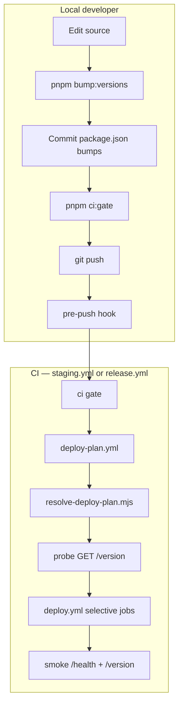

# DevOps & CI/CD — PipeWatch hosted surfaces

Engineering runbook for the selective version-aware deploy pipeline. Product spec: `PipeWatch_MVP_PRD.md` §22. Agent rules: `.cursor/rules/15-deploy-version-bumps.mdc`, `.cursor/rules/06-local-ci-before-commit.mdc`.

---

## Hosted surfaces

| Surface | Platform | Staging host | Production host | Fly / CF name |
|---|---|---|---|---|
| **api** | Fly.io | `staging-api.pipewatch.app` | `api.pipewatch.app` | `pipewatch-{staging\|prod}-api` |
| **worker** | Fly.io | internal 6PN | internal 6PN | `pipewatch-{staging\|prod}-worker` |
| **web** | Cloudflare Worker | `staging-cloud.pipewatch.app` | `cloud.pipewatch.app` | `pipewatch-{staging\|prod}-web` |
| **marketing** | Cloudflare Worker | `staging.pipewatch.app` | `pipewatch.app` | `pipewatch-{staging\|prod}-marketing` |
| **admin** | Fly.io (Web) | `staging-admin.pipewatch.app` | `admin.pipewatch.app` | `pipewatch-{staging\|prod}-admin` |
| **redis** | Fly.io | internal 6PN | internal 6PN | `pipewatch-{staging\|prod}-redis` |

**Infrastructure slug:** staging uses `staging`; production uses `prod` (not `production`).

**CE GHCR:** `api`, `worker`, `web` only — plan-gated on staging/release. Admin is cloud-only.

Each deployable exposes `GET /version` returning `{ "version": "<semver>" }` from its `package.json`. Marketing also serves `/health`.

---

## Selective deploy flow



**Deploy when:** intended `package.json` semver **>** live `/version` (auto mode).

**Skip when:** semver unchanged or live version already ≥ intended.

**Force full deploy:** `staging.yml` manual dispatch with `deploy_mode=manual`, or `force_full_deploy=true`.

**Production minimum:** surfaces below `1.0.0` are skipped in production plan.

---

## Version tooling

| Command | Purpose |
|---|---|
| `pnpm setup:hooks` | Install `.githooks/pre-push` (once per clone) |
| `pnpm bump:versions` | Bump deployables whose source changed since remote |
| `pnpm bump:versions:force` | Bump all deployables |
| `pnpm check:push-version-bumps` | Manual pre-push check |
| `pnpm check:push-version-bumps` | Runs automatically on push to `staging`/`main` |

Shared-lib → consumer map: `scripts/lib/package-version-policy.mjs` and `.cursor/rules/15-deploy-version-bumps.mdc`.

Locale JSON under `apps/web/src/i18n/` and `apps/marketing/` **requires** a version bump — not in the policy ignore list.

---

## Deploy-plan probe secret fallbacks

`scripts/ci/resolve-deploy-plan.mjs` probes live origins using GHA environment **secrets** with fallback chains — **no duplicate Phase keys**.

| Surface | Resolution order (first non-empty wins) |
|---|---|
| **api** | `APP_BASE_URL` → `API_ORIGIN` → `NEXT_PUBLIC_API_URL` |
| **web** | `FRONTEND_ORIGIN` → `APP_URL` |
| **marketing** | `MARKETING_ORIGIN` → `MARKETING_URL` |
| **admin** | `ADMIN_URL` |
| **worker** | `WORKER_PROBE_URL` (optional; often coupled to api when GHA cannot reach Fly 6PN) |

In `deploy_mode=auto`, missing probe origins for api/web/marketing fail the plan step with a named error — set at least one secret per chain in the GHA environment (synced from Phase).

**Cloudflare Access (staging admin smoke):** `CF_ACCESS_CLIENT_ID` + `CF_ACCESS_CLIENT_SECRET` in the staging GHA environment for CI smoke through the Access gate.

---

## Secrets flow

```
Phase Console  →  GitHub Actions environments (staging | production | ci)
                        ↓
              scripts/ci/sync-secrets.sh  →  Fly.io / Cloudflare Workers
```

- Workflows **never** fetch from Phase at runtime.
- `sync-secrets.yml` manual dispatch uses `stage-and-deploy` (immediate Fly rollout).
- Deploy chain uses `stage-only` (secrets applied on next `flyctl deploy`).
- Manifest: `packages/config/sync-secrets-manifest.ts`.

**Derived `REDIS_URL`:** not stored in Phase/GHA — `sync-secrets.sh` derives `redis://pipewatch-{staging|prod}-redis.internal:6379`.

**Migrations:** `DATABASE_URL_UNPOOLED` in staging/production GHA env only. Product migrations: `scripts/ci/run-migrate.sh`. Admin migrations: `scripts/ci/run-migrate-admin.sh`.

---

## Workflow entry points

| Workflow | Trigger | Chain |
|---|---|---|
| `pr.yml` | pull_request | ci → e2e (staging→main only) |
| `staging.yml` | push staging, manual | ci → deploy-plan → deploy → ce-images-* |
| `main.yml` | push main | ci → prepare-release + ce-images |
| `release.yml` | release published | check-not-deployed → deploy-plan → deploy → record DEPLOYED_VERSION |

Reusable: `ci.yml`, `deploy-plan.yml`, `deploy.yml`, `sync-secrets.yml`, `build-and-push-ce-image.yml`, `e2e.yml`.

All deploy `run:` paths use `scripts/ci/` — see PRD §22 script table.

---

## Operator commands

```bash
# Manual staging deploy on a specific ref
gh workflow run staging.yml --ref staging -f git_ref=staging -f deploy_mode=auto

# Force full staging deploy (skip live /version compare)
gh workflow run staging.yml --ref staging -f git_ref=staging -f deploy_mode=manual

# Secrets-only sync (immediate Fly rollout)
gh workflow run sync-secrets.yml -f environment=staging -f services=all

# On-demand E2E
gh workflow run e2e.yml -f target=staging
```

**Production:** publish a GitHub Release draft (from `prepare-release.yml` on push to `main`). `release.yml` compares tag to `vars.DEPLOYED_VERSION` before deploying.

---

## Local developer checklist (push to staging)

1. `pnpm setup:hooks` — first clone only
2. Implement changes
3. `pnpm bump:versions` — when deploy-relevant source changed
4. Stage explicit paths + commit
5. `pnpm ci:gate` — full local CI gate for code changes
6. `git push origin staging` — pre-push hook validates version bumps

Skip version bump check once: `SKIP_DEPLOY_VERSION_BUMP_CHECK=1 git push --no-verify`
